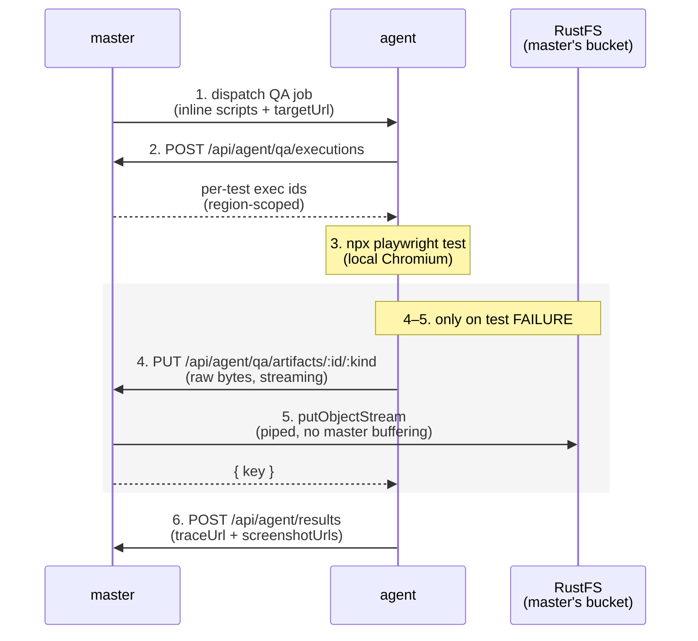

# Multi-region monitoring

Run probes from more than one location by attaching regional **agents** to your master. The master holds the schedule, fans jobs out per region, and aggregates results. Agents are stateless — they only need outbound HTTPS back to the master, no database, no Redis, no inbound ports. You can run agents on a $4 VPS, a home lab, or anywhere with outbound internet.

## Architecture

```
                                  ┌──────────────────────────────┐
                                  │   master (one instance)      │
                                  │  • UI / dashboard            │
                                  │  • scheduler + BullMQ        │
                                  │  • Postgres + Redis          │
                                  │  • /api/agent/{jobs,results} │
                                  └──────┬──────────────────┬────┘
                                         │ outbound HTTPS  │
                       ┌─────────────────┘                 └──────────────┐
                       │                                                  │
                ┌──────▼──────┐                                    ┌──────▼──────┐
                │  us-east    │                                    │  eu-west    │
                │  agent box  │                                    │  agent box  │
                │  (no DB)    │                                    │  (no DB)    │
                └─────────────┘                                    └─────────────┘
```

**Master** schedules jobs. For each due monitor, it looks up which regions it's bound to. If no regions are attached, the job runs locally on the master's in-process BullMQ workers (existing single-node behavior). If regions are attached, the job is pushed to one Redis list per region (`oo:jobs:<slug>`).

**Agents** long-poll `GET /api/agent/jobs?wait=N`. Master holds the connection open until a job is available or `N` seconds pass. Agent runs the probe locally, then POSTs the result to `/api/agent/results`. Each agent only sees its own region's jobs (authorized via the agent's API key).

**Why HTTP, not Redis-wire?** Agents on the open internet shouldn't need access to your Postgres or Redis. Outbound HTTPS to master is the only requirement — works through NAT, firewalls, home routers. The pattern mirrors how Pingdom, Better Stack, and Checkly all run their probe networks.

## Quick setup — adding your first region (~10 min)

### Prerequisite

**Your master must be reachable from the agent box.** If master binds to `127.0.0.1` (the default), agents on other boxes can't connect. Either:

- **Public HTTPS** — front master with a TLS reverse proxy. Caddy auto-LE works well; see `Security & deployment` in the main README.
- **Tailscale / Wireguard** — put master and agents on the same private network. Use the master's Tailscale IP or MagicDNS name as `OO_MASTER_URL`.

**Self-signed / internal-CA master.** By default the agent validates the
master's TLS cert (Bun's `fetch`), so a self-signed master is rejected.
Two ways through:

- **Recommended:** a real cert (Let's Encrypt via a Caddy reverse proxy),
  a private CA you've installed system-wide on the agent box, or skip
  TLS entirely by putting master + agents on a Tailscale/Wireguard
  tunnel (`OO_MASTER_URL=http://…` over the private net).
- **Escape hatch:** set `OO_AGENT_TLS_INSECURE=1` on the agent. This
  disables certificate verification **for the agent→master connection
  only** — probe targets the agent checks are still validated. It is
  **not low risk**: anyone on the agent↔master network path can then
  read or tamper with that traffic — suppress `FAILED` results, inject
  false `SUCCESS`, or steal the agent key on the first poll. The agent
  logs a loud warning at startup and hourly while it's on. Use it for a
  homelab you control end-to-end, not over the public internet.

### Step 1 — On master, create the region

Open the dashboard, click **Regions** in the header, fill in:

- **Slug** — lowercase, dashes only. `us-east`, `eu-west`, `home-lab`.
- **Label** — display name. `US East (Virginia)`, `Frankfurt`, etc.

Click **Create region**. A green panel appears with the cleartext API key — this is the **only time** it's shown. Click **Copy to clipboard**.

(CLI alternative: `docker compose exec worker bun scripts/create-region.ts --slug us-east --label "US East"`)

### Step 2 — On the agent box, fetch the two files and configure

```bash
# Fetch the agent compose + env template.
curl -O https://raw.githubusercontent.com/Observeone1/oo-workers/main/docker-compose.agent.yml
curl -O https://raw.githubusercontent.com/Observeone1/oo-workers/main/.env.agent.example
mv .env.agent.example .env

# Edit .env — set these three values:
#   OO_MASTER_URL   = https://master.example.com (or the Tailscale URL)
#   OO_AGENT_KEY    = oo_…  (paste from step 1)
#   OO_REGION_SLUG  = us-east

# Start the agent.
docker compose -f docker-compose.agent.yml up -d

# Watch the first long-poll succeed.
docker compose -f docker-compose.agent.yml logs -f agent
```

You should see `🛰 agent starting` followed by `agent picked up exec=… type=…` as soon as a monitor bound to this region fires.

### Step 3 — Back on master, bind monitors to the region

Refresh the **Regions** page — within 30 seconds, your new region's status dot should turn green.

Open any monitor's **+ Add monitor** dialog (or edit an existing monitor via the API). A "Run from" section now appears with checkboxes for each region. Check `us-east` → Create. The scheduler's next tick fans the monitor out to that region, and the agent picks it up.

(API alternative to set regions on an existing monitor:)

```bash
curl -X PUT https://master.example.com/api/monitors/url/42/regions \
  -H "Authorization: Bearer oo_<your-write-key>" \
  -H "content-type: application/json" \
  -d '{"regionIds": [1]}'
```

`regionIds: []` = run on master only. Multiple IDs = fan out to each (one execution row per region per interval).

## What works on agents

| Monitor type | Agent support |
| ------------ | ------------- |
| URL          | ✅            |
| API          | ✅            |
| TCP          | ✅            |
| UDP          | ✅            |
| Database     | ✅            |
| TLS          | ✅            |
| Browser (QA) | ✅            |

Browser (Playwright) monitors run on agents using the same Chromium runtime master uses (`mcr.microsoft.com/playwright`). The agent runs the test locally, then streams `trace.zip` + screenshots back to master via `PUT /api/agent/qa/artifacts/:executionId/:kind`. Master writes them to its own object-storage bucket — agents never get S3 credentials, and the "master's bucket = single source of truth" invariant is preserved (so `obs backup --include-artifacts` keeps capturing every artifact regardless of which region ran the test).

Artifacts are only generated on test **failure** (`trace: 'retain-on-failure'`, `screenshot: 'only-on-failure'`). A passing test produces no artifact upload — zero load on master.

### Artifact-routing flow



## Verifying QA-on-agents end-to-end

Two operator-facing smoke flows for the QA-on-agents path. Run once when first enabling it, and during release smoke.

### Real Docker agent + UI flow

1. Boot the dev stack: `bash scripts/dev/start.sh`. Master at `http://localhost:3010`.
2. Bootstrap the admin account in the UI. Open **Regions**, create a region (slug `local`, label "Local"). Copy the cleartext agent key shown in the reveal panel.
3. In a separate terminal, run an agent container against the local master:

   ```bash
   docker run --rm \
     -e OO_WORKER_ROLE=agent \
     -e OO_MASTER_URL=http://host.docker.internal:3010 \
     -e OO_AGENT_KEY=oo_<paste-cleartext-here> \
     -e OO_REGION_SLUG=local \
     observeone/oo-workers:latest
   ```

4. In the UI: **+ Add monitor → Browser**. Name it `smoke-qa-agent`, target URL `https://example.com`, paste a failing script:

   ```ts
   await page.goto(targetUrl);
   await page.locator('#does-not-exist').click({ timeout: 2000 });
   ```

5. In the **Run from** section, check the `local` region box. Create.
6. Within ~5 s (next scheduler tick), the agent log shows `agent picked up exec=0 type=qa` then `agent finished qa job=...`. The monitor detail page shows a FAILED execution with the region pill, a "trace" link, and screenshot thumbnails.
7. Click the trace link → a non-empty `trace.zip` downloads through the master's `/api/artifacts` proxy.

### Upload-failure degradation smoke

Proves the agent's retry-once-then-drop pattern is real, not just code. With the setup from above:

1. Stop RustFS mid-tick: `docker stop oo-rustfs`.
2. Wait for the next QA tick (~the monitor's `intervalSeconds`).
3. The agent log shows `qa artifact upload attempt 1 got 502`, then `qa artifact upload attempt 2 got 502` after the backoff, then a FAILED result is posted with `trace_url: null`. The monitor detail page renders the FAILED row with no trace link.
4. Restart RustFS: `docker start oo-rustfs`. The next tick recovers — trace + screenshots appear again.

### Forcing the light-image rejection path (for testing only)

Set `OO_AGENT_FORCE_LIGHT=1` on an agent that has Playwright installed. The agent reports any dispatched QA job as a single ERROR result with the message _"This agent is the light variant — redeploy with `observeone/oo-agent:qa` to handle QA jobs."_ Useful for verifying the error surfaces correctly in the UI before shipping a real light image, or for deliberately routing QA off a known-capable agent without rebuilding.

## Multiple agents per region

Running more than one agent for the same region is safe. Redis `BRPOP` guarantees only one agent receives each job, and master's result write is idempotent on `executionId`. You get parallel probe throughput for free.

Each agent box uses its own clone of the agent key bound to the region — the same key file. To deploy: copy the `.env` to each agent box, run the agent compose on each.

## Rotating an agent key

**From the UI:** open Regions → click **Rotate key** on the row → confirm. A new cleartext key panel appears; copy it.

**From the CLI:**

```bash
docker compose exec worker bun scripts/rotate-region-key.ts --slug us-east
```

Both paths are atomic: a new key is issued, the region's binding is updated, the old key is revoked, all in one transaction. The running agent starts getting 401 — restart it with the new env vars and it picks up where it left off. Region history (executions, last_seen_at, monitor bindings) is preserved.

## Deleting a region

**From the UI:** Regions → **Delete** on the row → confirm.

This revokes the agent's API key and removes all `monitor_regions` bindings (cascading). **Existing execution history is preserved** — the `region_id` on those rows is set to NULL, so they still show in detail views but lose the region attribution.

## Stalled executions

If an agent crashes mid-probe (machine power off, network drop, OOM), the corresponding execution row stays at `PENDING` in the master's database. The master keeps scheduling new probes every interval, so the metric stays fresh — only the stale row leaks.

The dashboard and API automatically project these as `FAILED` once they're older than 2× the monitor's interval. There's no background sweeper; the projection happens at read time. A late agent result (from a recovering agent) can still write into the row (the underlying status stays `PENDING` until something updates it), so the projection isn't destructive.

## Troubleshooting

### Agent log: `ECONNREFUSED` or DNS errors

The agent can't reach `OO_MASTER_URL`. Most common: master is bound to `127.0.0.1` and the agent is on a different box. Either expose master publicly (with TLS) or put both on the same VPN.

### Agent log: `401 invalid or revoked agent key`

The key was revoked (e.g., by a `rotate-region-key` you forgot about) or you mis-pasted the cleartext when setting `OO_AGENT_KEY`. Generate a new key via Rotate, paste it into the agent's `.env`, restart.

### Agent log: `socket connection was closed unexpectedly`

Should not happen with master at `v0.7.0+` (`Bun.serve idleTimeout` was bumped to 120s to fix this race). If you see it: confirm the master is on the latest tag.

### Region shows offline in the UI even though the agent is running

Check the agent's logs for backoff errors. If long-polls are succeeding (`agent picked up exec=…` lines appear), `regions.last_seen_at` updates on every poll. If the dashboard still shows offline, refresh — the threshold is 60s.

### Master upgraded, agent didn't

Run `docker compose -f docker-compose.agent.yml pull && docker compose -f docker-compose.agent.yml up -d` on each agent box after master version bumps. Agents are bundled in the same `observeone/oo-workers` image as master, so the agent compose pulls the same tag.

## Preflight

Run the connectivity check before starting the agent to catch DNS, TLS, auth, and region-slug mistakes up front:

```bash
docker compose -f docker-compose.agent.yml run --rm agent \
  bun scripts/check-agent-connectivity.ts
```

Reads `OO_MASTER_URL` / `OO_AGENT_KEY` / `OO_REGION_SLUG` from the agent's env (same vars the runtime uses), reports each step with ✅ / ❌, and exits non-zero on the first failure.

## Known gaps

- **Self-signed TLS** now has an escape hatch — `OO_AGENT_TLS_INSECURE=1`, scoped to the agent→master link with loud warnings (see **Prerequisite**). A trusted cert / tunnel is still strongly preferred.
- **No automated agent-version-skew warning yet** — if a master upgrade adds a required job-payload field, an un-pulled agent could mis-handle it. Mitigation today is the post-upgrade `pull` (see Troubleshooting). A master-side "region N versions behind" indicator is a tracked follow-up.
- **No header badge** showing online region count — open the Regions page to see status. On the polish backlog.
- **Slim "agent-only" image not yet shipped** — agents pull the same `observeone/oo-workers` image as master, which includes Playwright/Chromium (~1 GB). HTTP-only operators wanting a tiny agent image will get one in a future release; runtime detection is already in place so the swap is forward-compatible.
- **No per-region latency series** on the monitor detail page yet — all runs are listed flat. On the polish backlog.

## Reference

- Design doc (architecture choices, alternatives considered): `observeone-context/plans/2026-05-13-oo-workers-phase-4-multi-region.md` (internal)
- Source: `src/scheduler.ts` (dual-path dispatch), `src/agent.ts` (loop), `src/services/agent-dispatch.ts` (master-side), `src/services/region-admin.ts` (CRUD), `src/ui/regions.ts` (settings page)
